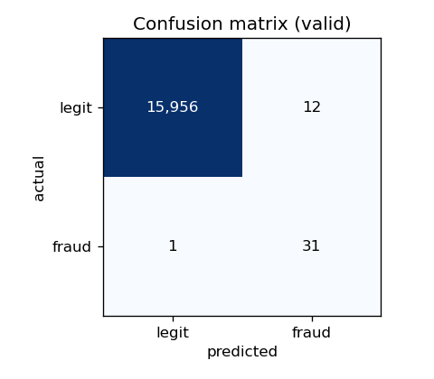

# Reorganising a Credit Card Fraud Detection Workflow Using MLOps Tools

**Module:** MLOps · **Assessment:** Final group project (40%) · **Dataset:** Credit Card Fraud Detection (ULB)

> **Draft status & academic integrity.** This report documents the system in
> this repository and is provided as a complete draft for the group to review,
> verify, and take ownership of. Per briefing §18, every claim, figure and design
> decision must be understood and confirmed by the authors before submission,
> and AI assistance must be acknowledged (see §11). The quantitative results in
> this draft were produced on a **synthetic** dataset with the identical schema
> (see §2.4); re-run the pipeline on the real Kaggle CSV to obtain
> submission-grade numbers — the workflow is unchanged.

---

## 1. Introduction

A digital bank or payment provider has built an initial credit-card fraud
detection model in a single exploratory notebook. The notebook is enough to
demonstrate that fraud *can* be predicted, but it is not something the business
can operate. Transactions arrive continuously in batches, fraud tactics evolve,
the cost of a missed fraud is very different from the cost of a false alarm, and
any decision the model makes must be auditable and reproducible by a colleague
months later. None of these operational realities are addressed by a notebook
that is run top-to-bottom by one person and whose outputs are saved by hand.

The purpose of this project is therefore **not** to maximise a single accuracy
figure. It is to demonstrate the module's core learning objective —
*reorganise workflows by employing MLOps tools to address new requirements or
constraints*. We take an experimental notebook as the baseline and reorganise it
into a modular, tested, tracked and monitored pipeline in which every stage
exists to satisfy a specific operational requirement. The central evidence of
achievement is the reorganisation itself: the movement from "a model that scores
well once" to "a workflow that keeps a model trustworthy over time".

This report is structured following the briefing's suggested outline. §2
describes the data and problem. §3 analyses the original notebook workflow and
its weaknesses. §4 lists the new operational requirements and why the notebook
is insufficient. §5 presents the reorganised architecture and justifies the tool
choices. §6 covers model development and experiment tracking. §7 covers
systematic testing, validation and threshold analysis. §8 covers monitoring,
drift analysis and the retraining trigger. §9 covers reproducibility and
deployment readiness. §10 concludes with lessons and future work.

## 2. Dataset and problem definition

### 2.1 The dataset

We use the ULB Credit Card Fraud Detection dataset, a standard benchmark of
anonymised European card transactions over two days. It contains 284,807
transactions and 31 columns: `Time` (seconds elapsed from the first
transaction), `V1`–`V28` (numeric features produced by a PCA transformation that
anonymises the original variables), `Amount` (the transaction value), and
`Class` (the target: `1` = fraud, `0` = legitimate). Because `V1`–`V28` are PCA
components, they are not individually interpretable, but `Time`, `Amount` and
`Class` are.

### 2.2 The target and class imbalance

There are only 492 fraudulent transactions, a fraud rate of approximately
**0.172%**. This extreme imbalance dominates every design decision. Accuracy is
useless — a model that predicts "legitimate" for every transaction scores
99.83% accuracy while catching zero fraud. The imbalance is why we evaluate with
precision, recall, F1, ROC-AUC and, most importantly, **PR-AUC** and the
confusion matrix at a chosen operating threshold (§7.3), and why the classifiers
are configured to counter imbalance via class weights and `scale_pos_weight`
(§6.1).

### 2.3 Dataset limitations

The public dataset covers only two days of transactions. Real production
monitoring observes weeks or months during which fraud tactics, customer
behaviour and merchant mixes all shift. We can *simulate* operational batches
using the `Time` feature (§8.1), but we acknowledge — as the briefing requires —
that two days of historical data is not equivalent to long-term production
monitoring. Any drift or retraining behaviour we demonstrate is a proof of the
*mechanism*, not a measurement of real-world fraud drift.

### 2.4 Data used in this repository

The real Kaggle CSV requires an account to download and is ~150 MB, so it is
neither committed to the repository nor available in continuous integration. To
keep the pipeline runnable and testable everywhere, `src/simulate_data.py`
generates a **clearly-labelled synthetic dataset** with the identical schema and
a realistic ~0.18% fraud rate. The fraud class carries a learnable signal — a
handful of PCA components are mean-shifted, mirroring how features such as
`V14`, `V4`, `V10`, `V12` and `V17` separate fraud in the real data — so that
metrics are meaningful rather than noise. This is a development and CI fixture
only; it is not a modelling contribution and is never presented as real data.
Dropping the genuine `creditcard.csv` into `data/raw/` makes every downstream
stage identical. All numeric results in this report were produced from the
synthetic dataset and are used solely to demonstrate the workflow.

## 3. The original workflow and its weaknesses

The baseline experimental workflow (acknowledged in `notebooks/README.md`) is a
representative Kaggle notebook for this dataset. Abstracted, it is:

> **Dataset → notebook preprocessing → model training → model evaluation →
> manual result saving**

It does its job as an experiment: it loads the data, scales `Amount`, trains a
classifier, and reports imbalance-aware metrics. But viewed as something to
operate, it has eight weaknesses that map one-to-one onto the new requirements
in §4:

1. **No data validation.** The notebook trusts its input. A malformed batch — a
   missing column, a negative `Amount`, a stray `Class = 2` — would either crash
   deep inside training or, worse, train silently on corrupt data.
2. **No experiment tracking.** Parameters, metrics and the trained model live in
   cell outputs and local variables. There is no record of what produced a given
   result, no way to compare runs, and no versioned model to deploy.
3. **Random-only splitting.** A random train/test split lets information from
   "the future" leak into training. In an operational setting where the model
   scores tomorrow's transactions, evaluation must respect time order.
4. **A fixed 0.5 decision threshold.** The notebook implicitly treats a false
   negative (missed fraud) and a false positive (a blocked legitimate customer)
   as equally costly. They are not.
5. **No monitoring or drift analysis.** Once trained, the model is assumed to
   stay valid forever. Nothing watches for the fraud patterns changing.
6. **No retraining logic.** There is no rule for *when* the model should be
   refreshed, so the decision is left to chance or to someone remembering.
7. **Not reproducible.** Unpinned dependencies, manual cell execution and
   hand-saved outputs mean another engineer cannot reliably reproduce the work.
8. **No automation or tests.** Nothing runs on a change to catch regressions.

## 4. New requirements and constraints

The business introduces eight requirements. For each we state the MLOps
implication and note why the notebook is insufficient.

| # | Requirement | MLOps implication | Why the notebook fails |
|---|-------------|-------------------|------------------------|
| 1 | New transaction batches arrive regularly | Repeatable ingestion + scoring | Manual, one-shot execution |
| 2 | Fraud patterns change over time | Drift / performance monitoring | No monitoring at all |
| 3 | Fraud is rare | Imbalance-aware evaluation | Uses accuracy-friendly framing |
| 4 | FN and FP have different cost | Threshold selection + trade-off | Fixed 0.5 threshold |
| 5 | Must be reproducible | Pinned env, versioning, seeds | Unpinned, manual |
| 6 | Detect data-quality issues early | Schema/range/null validation | Trusts input blindly |
| 7 | Track experiments | Versioned params/metrics/artefacts | Results in cell outputs |
| 8 | Justify retraining | A defined, justified trigger | No retraining logic |

The common thread is that each requirement demands a **persistent, inspectable
artefact or check** that a notebook does not produce: a validated schema, a
tracked run, a registered model, a monitoring report, a trigger decision log.
Reorganising the workflow is precisely the act of creating those artefacts and
wiring them together.

## 5. Reorganised MLOps workflow

### 5.1 Architecture

The reorganised workflow converts each notebook concern into an explicit,
independently-runnable stage. The full sequence is:

> **Ingest → Validate → Feature processing → Train (≥2 experiments) →
> Experiment tracking → Evaluate → Threshold selection → Register → Batch
> inference → Drift monitoring → Retraining trigger → (loop back to Train)**

Before-and-after diagrams are in
[`docs/workflow_diagrams.md`](workflow_diagrams.md). The key structural change is
that the linear notebook becomes a **directed dependency graph of stages**, each
reading and writing files on disk, orchestrated by a `Makefile` (and mirrored by
a `dvc.yaml` for `dvc repro`). One module per stage lives under `src/`:

| Stage | Module | Requirement(s) |
|-------|--------|----------------|
| Ingest + time-based batching | `src/ingest.py` | 1 |
| Data validation | `src/validate.py` | 6 |
| Feature processing | `src/features.py` | — |
| Training + tracking | `src/train.py` | 3, 7 |
| Evaluation | `src/evaluate.py` | 3 |
| Threshold selection | `src/threshold.py` | 4 |
| Batch inference | `src/batch_inference.py` | 1 |
| Drift monitoring | `src/drift.py` | 2 |
| Retraining trigger | `src/retrain_trigger.py` | 8 |

Stages communicate through a small on-disk contract: the *promoted* model
bundle in `models/` (model, scaler, threshold, baseline metrics) and the
evidence in `reports/`. This decoupling means any stage can be re-run in
isolation, which is what makes the workflow testable and reproducible.

### 5.2 Tool choices and justification

We deliberately chose a small, coherent tool set and can justify each — the
rubric rewards *appropriate* use, not maximal use.

- **Git / GitHub** — version control and collaboration; the substrate for CI and
  code review.
- **MLflow** — experiment tracking (params, metrics, artefacts) and a Model
  Registry to promote a specific version. We back MLflow with SQLite
  (`sqlite:///mlflow.db`) rather than the file store because the file store is
  deprecated in recent MLflow and does not support the registry.
- **Pandera** — declarative data validation. A schema reads like documentation
  and fails loudly on bad data before it reaches a model.
- **scipy + a native PSI implementation** — the drift *signal* (KS test and
  Population Stability Index) is computed with no heavy dependency, so the
  monitoring decision that drives retraining is simple, transparent and always
  available.
- **Evidently** — rich, human-readable HTML drift reports layered *on top of* the
  native signal (best-effort; the pipeline never depends on it).
- **XGBoost + scikit-learn** — the two model families for our ≥2 experiments.
- **Docker** — a pinned, portable runtime.
- **DVC** — data and artefact versioning and an alternative one-command
  reproduction (`dvc repro`).
- **Pytest + GitHub Actions** — systematic testing run automatically on every
  push, including a full pipeline smoke run.

A design principle throughout: **keep the critical path dependency-light and
push heavy or version-volatile tools to the edges.** Drift is computed natively;
Evidently is optional. This is why the pipeline runs identically whether or not
Evidently imports cleanly, which matters for reproducibility across machines.

## 6. Model development and experiment tracking

### 6.1 Models and the two experiments

The briefing requires at least two experiment runs. We train two model families
configured for imbalance:

1. **Logistic Regression** (baseline) with `class_weight="balanced"`.
2. **XGBoost** (improvement candidate) with `scale_pos_weight` set to the
   train-set negative/positive ratio, plus modest depth and 300 trees. If
   XGBoost is unavailable in an environment, the code falls back to a
   `RandomForestClassifier` with balanced class weights so the second experiment
   always runs.

The scaler for `Amount` is fit on the **training batch only** and persisted, so
inference applies exactly the same transform — avoiding train/serve skew and
data leakage.

### 6.2 Tracking and promotion with MLflow

Every run logs its parameters, the full imbalance-aware metric set, and the
model artefact to MLflow under the `fraud-detection` experiment. After both runs,
the pipeline **promotes the run with the best validation PR-AUC**: it writes the
model, scaler and baseline metrics to `models/` and registers the model in the
MLflow Model Registry under the name `fraud-detector`. Promotion is automatic and
reproducible rather than a manual "save the good one" step.

### 6.3 Results and comparison

On the synthetic development dataset (validation batch, default threshold 0.5):

| Model | PR-AUC | Recall | Notes |
|-------|--------|--------|-------|
| Logistic Regression | **0.968** | 0.969 | promoted |
| XGBoost | 0.929 | 0.844 | tracked |

Logistic Regression wins here because the synthetic fraud signal is close to
linearly separable by construction. On the *real* PCA-transformed data a
gradient-boosted model typically leads; the point for this project is that the
**promotion logic selects whichever model wins by PR-AUC**, and both runs are
tracked and comparable in MLflow. The validation confusion matrix for the
promoted model (threshold 0.5) is 31 true positives, 1 false negative, 12 false
positives and 15,956 true negatives, i.e. recall 0.969 at precision 0.72 — the
starting point the threshold stage then optimises.

## 7. Systematic testing and validation

### 7.1 Data validation (requirement 6)

`src/validate.py` defines a Pandera `DataFrameSchema` that encodes the dataset
contract: `Time ≥ 0`, all of `V1`–`V28` present and non-null, `Amount ≥ 0`,
`Class ∈ {0, 1}`, and `strict=True` so unexpected columns are rejected. The raw
dataset is validated before training, and **every production batch is validated
before it is scored** (§8.2). Bad data fails fast with a clear error rather than
silently corrupting a model or a prediction.

### 7.2 Unit tests (requirement, and rubric "systematic testing")

The `tests/` suite (13 tests, run in CI) covers the logic that matters:

- **Splitting** is time-ordered and disjoint (`test_ingest.py`).
- **Drift injection** shifts `Amount` and the signal features as intended, and
  the concept-drift shift moves fraud rows further than legitimate ones.
- **Schema validation** accepts good rows and rejects a bad target or a negative
  amount (`test_validate.py`).
- **Metrics** are correct on a known-perfect classifier (`test_metrics.py`).
- **Threshold selection** prefers a low threshold when false negatives are
  costly.
- **The trigger** returns `ok` / `warning` / `retrain` for the right inputs.
- **PSI** is zero for identical distributions and large under a mean shift;
  **feature drift** flags only the shifted features (`test_drift.py`).
- **Batch inference** produces correctly-thresholded predictions and handles
  batches with or without labels (`test_inference.py`).

### 7.3 Imbalance-aware evaluation

`src/evaluate.py` centralises the metric definition used everywhere:
PR-AUC, ROC-AUC, precision, recall, F1, false-positive rate, false-negative rate
and the full confusion matrix at a given threshold. PR-AUC and recall are treated
as primary because, under 0.17% prevalence, they reflect fraud-catching ability
in a way accuracy and even ROC-AUC can mask. The stage also emits the confusion
matrix and PR-curve figures above as committed evidence.

### 7.4 Threshold analysis (requirement 4)

A fraud model's *operating threshold* is a business decision, not a default.
`src/threshold.py` sweeps thresholds from 0.01 to 0.99 and picks the one that
minimises an expected business cost, with a false negative weighted 100× a false
positive (`params.yaml`). On the synthetic data this selects a threshold of
**0.95** with an expected cost of 103, giving recall 0.969 at precision 0.91.

The trade-off figure makes the decision legible: recall stays high across a wide
range of thresholds while precision climbs, so the cost-minimising point sits at
a high threshold that preserves fraud detection while cutting false alarms.
Crucially, the chosen threshold becomes the **operating point** for inference and
the **recall baseline** for the trigger — the cost trade-off is threaded through
the rest of the pipeline rather than being a one-off plot.

## 8. Monitoring, drift analysis and the retraining trigger

### 8.1 Batch simulation (requirement 1, briefing §10)

We split strictly by `Time` — never randomly — into an early **training** half,
a **validation** fifth (used for threshold tuning and as the performance
baseline), and the remaining data as three equal **production** batches
(`prod_1`–`prod_3`). This respects the operational reality that the model scores
future transactions using only past data.

To demonstrate monitoring, `src/ingest.py` can inject a **clearly-labelled**
synthetic shift into one production batch (`prod_3` by default). It does two
things at once: it scales `Amount` and shifts the signal PCA components for all
rows (covariate/feature drift), and it pushes the *fraud* rows an extra step so
they overlap the legitimate cloud (concept drift the trained model has never
seen). This is a proof of the mechanism; as noted in §2.3 it is not real fraud
drift.

### 8.2 Batch inference (requirement 1)

`src/batch_inference.py` loads the promoted model, scaler and threshold;
**validates** each production batch against the Pandera schema; scores it; and
writes predictions (probability, label, and the true `Class` where available)
for the monitoring stage. On the synthetic data, `prod_1` and `prod_2` flag 20
and 14 transactions respectively, while the drifted `prod_3` flags **0** at the
0.95 threshold — the first visible symptom that something has changed.

### 8.3 Drift analysis (requirement 2, briefing §12)

`src/drift.py` compares each production batch against the training reference
across all the drift areas the briefing lists:

- **Feature drift** — per feature, a Kolmogorov–Smirnov test and the Population
  Stability Index. A feature counts as drifted if PSI > 0.2 (a standard rule of
  thumb) or the KS test is significant at p < 0.05.
- **Amount drift** — PSI on `Amount` specifically, an interpretable feature.
- **Prediction drift** — PSI between the reference and batch predicted
  probability distributions.
- **Target drift** — the batch fraud rate versus the training baseline.
- **Performance drift** — PR-AUC, recall and precision recomputed on the batch
  (labels are available here; in production they arrive with a delay, §8.5).

Each batch produces a JSON summary (the machine-readable contract for the
trigger), a PSI bar chart, and — when Evidently imports cleanly — a rich HTML
report. The results on synthetic data:

| Batch | % features drifted | Amount PSI | Prediction PSI | PR-AUC | Recall | Verdict |
|-------|--------------------|------------|----------------|--------|--------|---------|
| prod_1 | 7% | 0.00 | 0.00 | 0.995 | 0.950 | stable |
| prod_2 | 3% | 0.00 | 0.00 | 0.942 | 0.867 | stable |
| prod_3 | 31% | 0.89 | 12.4 | 0.001 | 0.000 | drifted |

The PSI chart for `prod_3` shows exactly the injected signal components
(`V4, V10, V11, V12, V14, V17`) plus `Amount` far above the threshold, while
untouched features stay near zero — evidence that the detector localises drift
rather than raising a blanket alarm.

### 8.4 The retraining trigger (requirement 8, briefing §13)

`src/retrain_trigger.py` implements the rule, with thresholds in `params.yaml`:

> **Retrain or review** the model if the batch PR-AUC drops more than **10%**
> versus the validation baseline, **or** recall at the operating threshold falls
> below **0.75**, **or** more than **30%** of monitored features have drifted. A
> milder feature-drift level (15–30%) raises a **warning** rather than a retrain.

Justification of the thresholds:

- **PR-AUC −10%** captures a meaningful loss of ranking quality while tolerating
  normal batch-to-batch noise.
- **Recall floor 0.75** is a business guarantee: below it we are missing too many
  frauds regardless of other metrics. It is deliberately expressed at the
  *operating threshold*, because a model can retain a high PR-AUC (good ranking)
  yet still collapse at its operating point — exactly what `prod_3` shows
  (PR-AUC would look fine on ranking alone, but recall is 0). This is why the
  rule checks operating-point recall and not only PR-AUC.
- **30% of features drifted** signals that the input distribution has moved
  broadly, not just in one incidental feature.

Applied to the batches, the trigger produces `reports/trigger_log.md`:

| Batch | Decision | Reason |
|-------|----------|--------|
| prod_1 | ✅ ok | within all thresholds |
| prod_2 | ✅ ok | within all thresholds |
| prod_3 | 🚨 retrain | PR-AUC drop 100% > 10%; recall 0.00 < 0.75; 31% drifted > 30% |

This matches the briefing's expected behaviour table — normal batches do not
trigger, and a batch with many shifted features and degraded recall does. The
decision is written to an audit log rather than being implicit.

### 8.5 Risks and limitations

We discuss the risks the briefing asks about honestly:

- **False drift alarms.** KS is very sensitive at large sample sizes and can flag
  trivial shifts; that is why the rule pairs it with PSI and with a warning band
  before a hard retrain.
- **Delayed fraud labels.** In production, ground-truth fraud labels arrive days
  or weeks late (chargebacks, investigations). The performance side of the
  trigger is therefore lagged; feature and prediction drift (which need no
  labels) act as earlier warnings.
- **Retraining on poor-quality data.** A retrain fired by a data-quality
  incident could learn from corrupt data — which is why validation gates every
  batch first.
- **Overreacting to short-term variation** and the **operational cost of
  frequent retraining** — the thresholds and the warning band are tuned to avoid
  retraining on noise.
- **Simulated, not real, drift.** As in §2.3, this demonstrates the mechanism on
  two days of data, not genuine long-term fraud evolution.

## 9. Reproducibility and deployment readiness

Reproducibility is treated as a first-class requirement, not an afterthought:

- **Pinned dependencies** in `requirements.txt`, matching the versions the
  pipeline was verified against.
- **Docker** (`python:3.11-slim`) for a portable runtime; `docker build` then
  `docker run` executes the whole pipeline.
- **Fixed seeds** across data simulation, splitting and model training.
- **DVC** stage graph (`dvc.yaml`) for data/artefact versioning and `dvc repro`.
- **A single command** — `make pipeline` — runs the full workflow in dependency
  order and regenerates every artefact; `make test` runs the suite.
- **Continuous integration** (GitHub Actions) installs the pinned environment,
  runs the tests, runs a data-validation smoke check, and executes the **entire
  pipeline on synthetic data**, uploading the resulting evidence as a build
  artefact — so every push proves the workflow still runs end-to-end.

**Prototype limitations.** The MLflow backend is local SQLite and artefacts are
stored on the local filesystem; a production deployment would use a shared
tracking server and object storage. Batch inference is file-based, not a live
service. And, as repeatedly noted, the demonstrated numbers come from synthetic
data. None of these change the workflow; they are the natural next steps from a
course prototype to a production system.

## 10. Conclusion

We reorganised a single-notebook fraud-detection experiment into an
MLOps-enabled workflow in which every stage exists to satisfy a stated
operational requirement: repeatable ingestion and batching, Pandera validation,
imbalance-aware training tracked in MLflow with automatic promotion to a model
registry, cost-based threshold selection, batch inference, native drift and
performance monitoring with optional Evidently reports, and a justified,
audit-logged retraining trigger — all pinned, containerised, tested and run
under CI.

**Lessons learned.** First, the hardest part of MLOps is not any single tool but
the *contracts between stages* — deciding what each stage reads and writes so the
workflow is decoupled and testable. Second, metric choice is a design decision
with teeth: the `prod_3` case, where ranking quality and operating-point recall
diverge under drift, showed why the trigger must watch the metric the business
actually operates on. Third, keeping the critical path dependency-light (native
drift, optional Evidently) bought us reproducibility that a heavier design would
have lost.

**Future work.** Replace synthetic data with the real Kaggle dataset and
re-tune thresholds; move MLflow to a shared server and add automated model
promotion gates; expose inference as a service with online monitoring; add
explainability (e.g. SHAP) to support fraud-analyst review and audit; and extend
the trigger with label-delay-aware performance estimation. The workflow is built
to absorb these changes stage by stage — which was the whole point of
reorganising it.

## 11. Acknowledgements

- **Baseline notebook.** Acknowledged in `notebooks/README.md`; the
  reorganisation and additions are described there and throughout this report.
- **Dataset.** ULB Credit Card Fraud Detection (Kaggle / Zenodo).
- **AI assistance (briefing §18).** Generative AI was used for drafting and
  debugging assistance. All code, analysis and written discussion must be
  reviewed and understood by the authors before submission; results were
  verified by running the pipeline.

## 12. References

- Kaggle — Credit Card Fraud Detection dataset: https://www.kaggle.com/datasets/mlg-ulb/creditcardfraud
- Le Borgne, Siblini, Lebichot & Bontempi — *Reproducible Machine Learning for
  Credit Card Fraud Detection (Practical Handbook)*:
  https://fraud-detection-handbook.github.io/fraud-detection-handbook/Foreword.html
- Zenodo dataset record: https://zenodo.org/records/7395559
- MLflow documentation: https://mlflow.org/docs/latest/index.html
- Pandera documentation: https://pandera.readthedocs.io/
- Evidently AI documentation: https://docs.evidentlyai.com/
- scikit-learn model evaluation: https://scikit-learn.org/stable/modules/model_evaluation.html
