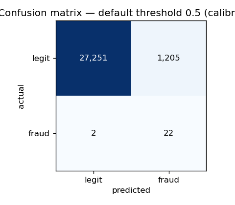
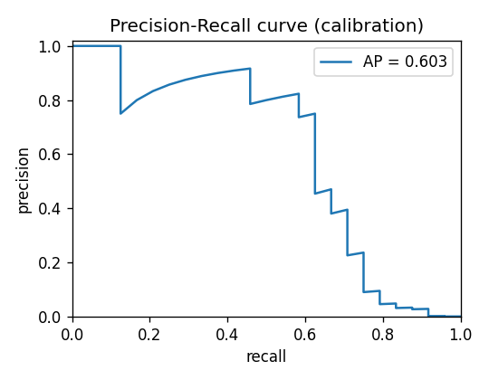
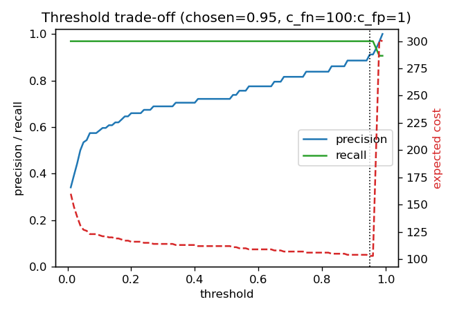
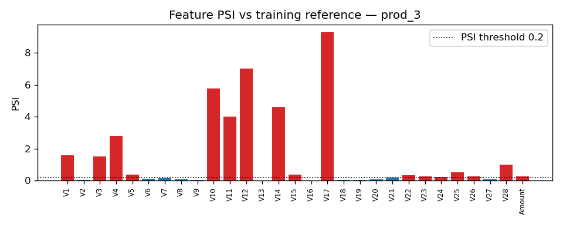

# Reorganising a Credit Card Fraud Detection Workflow Using MLOps Tools

**Module:** MLOps · **Assessment:** Final group project (40%) · **Dataset:** Credit Card Fraud Detection (ULB)

> **Draft status & academic integrity.** This report documents the system in
> this repository and is provided as a complete draft for the group to review,
> verify, and take ownership of. Per briefing §18, every claim, figure and design
> decision must be understood and confirmed by the authors before submission,
> and AI assistance must be acknowledged (see §11). The quantitative results
> below are from the **real ULB dataset** (284,807 transactions), obtained via
> OpenML with `make fetch-data` (see §2.4). A synthetic generator with the
> identical schema is retained for CI and offline development.

---

## 1. Introduction

A digital bank or payment provider has built an initial credit-card fraud
detection model in a single exploratory notebook. The notebook is enough to
demonstrate that fraud *can* be predicted, but it is not something the business
can operate. Transactions arrive continuously in batches, fraud tactics evolve,
the cost of a missed fraud is very different from the cost of a false alarm, and
any decision the model makes must be auditable and reproducible by a colleague
months later. None of these operational realities are addressed by a notebook
that is run top-to-bottom by one person and whose outputs are saved by hand.

The purpose of this project is therefore **not** to maximise a single accuracy
figure. It is to demonstrate the module's core learning objective —
*reorganise workflows by employing MLOps tools to address new requirements or
constraints*. We take an experimental notebook as the baseline and reorganise it
into a modular, tested, tracked and monitored pipeline in which every stage
exists to satisfy a specific operational requirement. The central evidence of
achievement is the reorganisation itself: the movement from "a model that scores
well once" to "a workflow that keeps a model trustworthy over time".

This report is structured following the briefing's suggested outline. §2
describes the data and problem. §3 analyses the original notebook workflow and
its weaknesses. §4 lists the new operational requirements and why the notebook
is insufficient. §5 presents the reorganised architecture and justifies the tool
choices. §6 covers model development and experiment tracking. §7 covers
systematic testing, validation and threshold analysis. §8 covers monitoring,
drift analysis and the retraining trigger. §9 covers reproducibility and
deployment readiness. §10 concludes with lessons and future work.

## 2. Dataset and problem definition

### 2.1 The dataset

We use the ULB Credit Card Fraud Detection dataset, a standard benchmark of
anonymised European card transactions over two days. It contains 284,807
transactions and 31 columns: `Time` (seconds elapsed from the first
transaction), `V1`–`V28` (numeric features produced by a PCA transformation that
anonymises the original variables), `Amount` (the transaction value), and
`Class` (the target: `1` = fraud, `0` = legitimate). Because `V1`–`V28` are PCA
components, they are not individually interpretable, but `Time`, `Amount` and
`Class` are.

### 2.2 The target and class imbalance

There are only 492 fraudulent transactions, a fraud rate of approximately
**0.172%**. This extreme imbalance dominates every design decision. Accuracy is
useless — a model that predicts "legitimate" for every transaction scores
99.83% accuracy while catching zero fraud. The imbalance is why we evaluate with
precision, recall, F1, ROC-AUC and, most importantly, **PR-AUC** and the
confusion matrix at a chosen operating threshold (§7.3), and why the classifiers
are configured to counter imbalance via class weights and `scale_pos_weight`
(§6.1).

### 2.3 Dataset limitations

The public dataset covers only two days of transactions. Real production
monitoring observes weeks or months during which fraud tactics, customer
behaviour and merchant mixes all shift. We can *simulate* operational batches
using the `Time` feature (§8.1), but we acknowledge — as the briefing requires —
that two days of historical data is not equivalent to long-term production
monitoring. Any drift or retraining behaviour we demonstrate is a proof of the
*mechanism*, not a measurement of real-world fraud drift.

### 2.4 Data used in this repository

The results in this report use the **real ULB dataset** — 284,807 transactions,
492 frauds (0.172%), spanning the genuine two-day window (`Time` 0–172,792 s).
The canonical source (Kaggle `mlg-ulb/creditcardfraud`) sits behind a login, so
`src/fetch_data.py` (`make fetch-data`) downloads the identical data from its
open **OpenML** mirror (dataset 1597). One practical detail: OpenML flags `Time`
as a row-identifier, so the usual `fetch_openml` call silently drops it; because
our time-based batching depends on `Time`, we download the raw parquet instead,
which preserves all 31 columns in the canonical schema. The 144 MB CSV is not
committed (git-ignored) — teammates and graders regenerate it with one command.

For continuous integration and offline development we also provide
`src/simulate_data.py`, a **clearly-labelled synthetic** generator with the
identical schema and a realistic ~0.18% fraud rate, whose fraud class carries a
learnable signal (a few PCA components mean-shifted, mirroring how `V14`, `V4`,
`V10`, `V12`, `V17` separate fraud in the real data). It is a fixture, never
presented as real data, so CI stays fast, deterministic and network-free. Both
datasets flow through exactly the same pipeline.

**Provenance of the numbers in this report.** Every quantitative result below
comes from one authoritative run, recorded in `reports/run_manifest.json`:

| | |
|---|---|
| Dataset | `REAL — ULB creditcard via OpenML dataset 1597` |
| Rows / frauds | 284,807 / 492 (0.1727%) |
| Data SHA-256 | `1700322b377ac8340ab6b75f22b974944fbcaf5b4f0daf3d5e8f620d96313026` |
| Source commit | `36b76a0` |
| Python | 3.13.9 |
| Promoted model | `fraud-detector:v1` (MLflow run `174fd070411c45f28562d346b253396b`) |

The chronological split gives `train` 142,403 rows (269 frauds), `model_valid`
28,480 (91), `calibration` 28,480 (24), and three production batches of ~28,481
each. Any figure quoted here can be traced to the JSON contract that produced it,
and the whole run is reproducible with
`SOURCE_COMMIT="$(git rev-parse HEAD)" make verify`.

## 3. The original workflow and its weaknesses

The baseline experimental workflow (acknowledged in `notebooks/README.md`) is a
representative Kaggle notebook for this dataset. Abstracted, it is:

> **Dataset → notebook preprocessing → model training → model evaluation →
> manual result saving**

It does its job as an experiment: it loads the data, scales `Amount`, trains a
classifier, and reports imbalance-aware metrics. But viewed as something to
operate, it has eight weaknesses that map one-to-one onto the new requirements
in §4:

1. **No data validation.** The notebook trusts its input. A malformed batch — a
   missing column, a negative `Amount`, a stray `Class = 2` — would either crash
   deep inside training or, worse, train silently on corrupt data.
2. **No experiment tracking.** Parameters, metrics and the trained model live in
   cell outputs and local variables. There is no record of what produced a given
   result, no way to compare runs, and no versioned model to deploy.
3. **Random-only splitting.** A random train/test split lets information from
   "the future" leak into training. In an operational setting where the model
   scores tomorrow's transactions, evaluation must respect time order.
4. **A fixed 0.5 decision threshold.** The notebook implicitly treats a false
   negative (missed fraud) and a false positive (a blocked legitimate customer)
   as equally costly. They are not.
5. **No monitoring or drift analysis.** Once trained, the model is assumed to
   stay valid forever. Nothing watches for the fraud patterns changing.
6. **No retraining logic.** There is no rule for *when* the model should be
   refreshed, so the decision is left to chance or to someone remembering.
7. **Not reproducible.** Unpinned dependencies, manual cell execution and
   hand-saved outputs mean another engineer cannot reliably reproduce the work.
8. **No automation or tests.** Nothing runs on a change to catch regressions.

## 4. New requirements and constraints

The business introduces eight requirements. For each we state the MLOps
implication and note why the notebook is insufficient.

| # | Requirement | MLOps implication | Why the notebook fails |
|---|-------------|-------------------|------------------------|
| 1 | New transaction batches arrive regularly | Repeatable ingestion + scoring | Manual, one-shot execution |
| 2 | Fraud patterns change over time | Drift / performance monitoring | No monitoring at all |
| 3 | Fraud is rare | Imbalance-aware evaluation | Uses accuracy-friendly framing |
| 4 | FN and FP have different cost | Threshold selection + trade-off, and explainable flags for the analysts who work the queue | Fixed 0.5 threshold, no attribution |
| 5 | Must be reproducible | Pinned env, versioning, seeds | Unpinned, manual |
| 6 | Detect data-quality issues early | Schema/range/null validation | Trusts input blindly |
| 7 | Track experiments | Versioned params/metrics/artefacts | Results in cell outputs |
| 8 | Justify retraining | A defined, justified trigger | No retraining logic |

The common thread is that each requirement demands a **persistent, inspectable
artefact or check** that a notebook does not produce: a validated schema, a
tracked run, a registered model, a monitoring report, a trigger decision log.
Reorganising the workflow is precisely the act of creating those artefacts and
wiring them together.

## 5. Reorganised MLOps workflow

### 5.1 Architecture

The reorganised workflow converts each notebook concern into an explicit,
independently-runnable stage. The full sequence is:

> **Ingest → Validate → Feature processing → Train (≥2 experiments) →
> Experiment tracking → Evaluate → Threshold selection → Register → Explain →
> Batch inference → Drift monitoring → Retraining trigger → (loop back to
> Train)**

Before-and-after diagrams are in
[`docs/workflow_diagrams.md`](workflow_diagrams.md). The key structural change is
that the linear notebook becomes a **directed dependency graph of stages**, each
reading and writing files on disk, orchestrated by a `Makefile` (and mirrored by
a `dvc.yaml` for `dvc repro`). One module per stage lives under `src/`:

| Stage | Module | Requirement(s) |
|-------|--------|----------------|
| Ingest + time-based batching | `src/ingest.py` | 1 |
| Data validation | `src/validate.py` | 6 |
| Feature processing | `src/features.py` | — |
| Training + tracking | `src/train.py` | 3, 7 |
| Evaluation | `src/evaluate.py` | 3 |
| Threshold selection | `src/threshold.py` | 4 |
| Explainability | `src/explain.py` | 4 |
| Batch inference | `src/batch_inference.py` | 1 |
| Drift monitoring | `src/drift.py` | 2 |
| Retraining trigger | `src/retrain_trigger.py` | 8 |

Stages communicate through a small on-disk contract: the *promoted* model
bundle in `models/` (model, scaler, threshold, baseline metrics) and the
evidence in `reports/`. This decoupling means any stage can be re-run in
isolation, which is what makes the workflow testable and reproducible.

### 5.2 Tool choices and justification

We deliberately chose a small, coherent tool set and can justify each — the
rubric rewards *appropriate* use, not maximal use.

- **Git / GitHub** — version control and collaboration; the substrate for CI and
  code review.
- **MLflow** — experiment tracking (params, metrics, artefacts) and a Model
  Registry to promote a specific version. We back MLflow with SQLite
  (`sqlite:///mlflow.db`) rather than the file store because the file store is
  deprecated in recent MLflow and does not support the registry.
- **Pandera** — declarative data validation. A schema reads like documentation
  and fails loudly on bad data before it reaches a model.
- **scipy + a native PSI implementation** — the drift *signal* (KS test and
  Population Stability Index) is computed with no heavy dependency, so the
  monitoring decision that drives retraining is simple, transparent and always
  available.
- **Evidently** — rich, human-readable HTML drift reports layered *on top of* the
  native signal (best-effort; the pipeline never depends on it).
- **SHAP** — model interpretation and audit support (briefing §8). Chosen over
  reading the logistic-regression coefficients directly because coefficients
  describe the model in the abstract, while SHAP describes its behaviour on the
  transactions actually observed — a distinction that turns out to matter for
  `Amount` (§7.5).
- **XGBoost + scikit-learn** — the two model families for our ≥2 experiments.
- **Docker** — a pinned, portable runtime.
- **DVC** — data and artefact versioning and an alternative one-command
  reproduction (`dvc repro`).
- **Pytest + GitHub Actions** — systematic testing run automatically on every
  push, including a full pipeline smoke run.

A design principle throughout: **keep the critical path dependency-light and
push heavy or version-volatile tools to the edges.** Drift is computed natively;
Evidently is optional. This is why the pipeline runs identically whether or not
Evidently imports cleanly, which matters for reproducibility across machines.

## 6. Model development and experiment tracking

### 6.1 Models and the two experiments

The briefing requires at least two experiment runs. We train two model families
configured for imbalance:

1. **Logistic Regression** (baseline) with `class_weight="balanced"`.
2. **XGBoost** (improvement candidate) with `scale_pos_weight` set to the
   train-set negative/positive ratio, plus modest depth and 300 trees. If
   XGBoost is unavailable in an environment, the code falls back to a
   `RandomForestClassifier` with balanced class weights so the second experiment
   always runs.

The scaler for `Amount` is fit on the **training batch only** and persisted, so
inference applies exactly the same transform — avoiding train/serve skew and
data leakage.

### 6.2 Tracking and promotion with MLflow

Every run logs its parameters, the full imbalance-aware metric set, and the
model artefact to MLflow under the `fraud-detection` experiment. After both runs,
the pipeline **promotes the run with the best validation PR-AUC**: it writes the
model, scaler and baseline metrics to `models/` and registers the model in the
MLflow Model Registry under the name `fraud-detector`. Promotion is automatic and
reproducible rather than a manual "save the good one" step.

### 6.3 Results and comparison

On the real ULB dataset (`model_valid` slice, 28,480 rows / 91 frauds, default
threshold 0.5):

| Model | PR-AUC | ROC-AUC | Recall | Precision | Notes |
|-------|--------|---------|--------|-----------|-------|
| Logistic Regression | **0.865** | 0.976 | 0.912 | 0.071 | promoted |
| XGBoost | 0.835 | 0.983 | 0.846 | 0.713 | tracked |

Both runs are tracked and directly comparable in MLflow; the **promotion logic
selects whichever wins by PR-AUC** — here the class-weighted Logistic Regression,
by a small margin over a lightly-tuned XGBoost. (Model choice is not the point of
the project, and neither model is heavily tuned; the reorganisation is what is
assessed.) A PR-AUC of ~0.87 is in the expected range for this dataset.

The comparison also shows why a single headline number is not enough: XGBoost has
the better ROC-AUC (0.983 vs 0.976) and vastly better precision at 0.5, yet loses
on PR-AUC, the metric that matters under 0.17% prevalence. Selecting on PR-AUC is
a deliberate, recorded choice — `reports/promotion_record.json` names the metric,
the winning run and the reason.

Evaluated on the held-out `calibration` slice at the **default 0.5 threshold**,
the promoted model gives 22 true positives and 2 false negatives, but **1,205
false positives** (recall 0.917, precision just **0.018**). A model that blocks
1,205 legitimate customers to catch 22 frauds is operationally useless — which is
exactly why the fixed-0.5 notebook is inadequate (requirement 4) and why the
threshold stage (§7.4) is essential.

## 7. Systematic testing and validation

### 7.1 Data validation (requirement 6)

`src/validate.py` defines a Pandera `DataFrameSchema` that encodes the dataset
contract: `Time ≥ 0`, all of `V1`–`V28` present and non-null, `Amount ≥ 0`,
`Class ∈ {0, 1}`, and `strict=True` so unexpected columns are rejected. The raw
dataset is validated before training, and **every production batch is validated
before it is scored** (§8.2). Bad data fails fast with a clear error rather than
silently corrupting a model or a prediction.

### 7.2 Unit tests (requirement, and rubric "systematic testing")

The `tests/` suite (**107 tests across 13 files**, run in CI) covers the logic
that matters. 105 are evidence-independent and run as `make test-fast` before
anything else; the remaining 2 are marked `integration` because they read
generated pipeline evidence. None are skipped — `test_reproducibility.py`
asserts that no test carries a skip marker, so a silent skip cannot hide a
failure. The suite covers:

- **Splitting** is time-ordered and disjoint (`test_ingest.py`).
- **Drift injection** shifts `Amount` and the signal features as intended, and
  the concept-drift shift moves fraud rows further than legitimate ones.
- **Schema validation** accepts good rows and rejects a bad target or a negative
  amount (`test_validate.py`).
- **Metrics** are correct on a known-perfect classifier (`test_metrics.py`).
- **Threshold selection** prefers a low threshold when false negatives are
  costly.
- **The trigger** returns `ok` / `warning` / `retrain` for the right inputs.
- **PSI** is zero for identical distributions and large under a mean shift;
  **feature drift** flags only the shifted features (`test_drift.py`).
- **Batch inference** produces correctly-thresholded predictions and handles
  batches with or without labels (`test_inference.py`).
- **Explainability evidence** is correctly ranked, and its `promoted_model_id`
  and calibration fingerprint match the operating point, so an explanation can
  never be reported against a different model than the one promoted
  (`test_explain.py`).

### 7.3 Imbalance-aware evaluation

`src/evaluate.py` centralises the metric definition used everywhere:
PR-AUC, ROC-AUC, precision, recall, F1, false-positive rate, false-negative rate
and the full confusion matrix at a given threshold. PR-AUC and recall are treated
as primary because, under 0.17% prevalence, they reflect fraud-catching ability
in a way accuracy and even ROC-AUC can mask. The stage also emits the confusion
matrix and PR-curve figures above as committed evidence.

### 7.4 Threshold analysis (requirement 4)

A fraud model's *operating threshold* is a business decision, not a default.
`src/threshold.py` sweeps thresholds from 0.01 to 0.99 and picks the one that
minimises an expected business cost, with a false negative weighted 100× a false
positive (`params.yaml`). On the real data this selects a threshold of **0.98**,
moving the model from the unusable 0.5 operating point to a defensible
fraud-operations trade-off:

| | Default 0.5 | Operating 0.98 |
|---|---:|---:|
| Precision | 0.018 | **0.214** |
| Recall | 0.917 | 0.750 |
| False positives | 1,205 | **66** |
| False negatives | 2 | 6 |
| Estimated business cost | 1,405 | **666** |

Choosing the cost-minimising threshold cuts false alarms **18-fold** and the
modelled business cost by **53%**, at the price of 17 points of recall — four
additional missed frauds in exchange for 1,139 fewer blocked customers. Under the
stated 100:1 cost ratio that is the better operating point, and the point is that
the ratio, not a default, is what decides it.

The trade-off figure makes the decision legible: as the threshold rises,
precision climbs steeply while recall declines gently, so the cost-minimising
point sits at a high threshold that preserves most fraud detection while
sharply cutting false alarms. Crucially, the chosen threshold becomes the
**operating point** for inference and the **recall baseline** for the trigger —
the cost trade-off is threaded through the rest of the pipeline rather than being
a one-off plot.

### 7.5 Explainability (requirement 4, briefing §8)

The threshold decides *how many* transactions enter the review queue, not *why*
any one of them is in it. The operating point sends 84 calibration transactions
to analysts of which 66 are false alarms (§7.4), so the analyst working that
queue needs a reason. `src/explain.py` runs SHAP against the promoted model over
a seeded 2,000-row sample of the calibration slice, emitting a global
attribution ranking and a local explanation for the highest-scoring transaction.

**Validating the implementation.** For a linear model SHAP has a closed form —
attribution equals `coef_j × (x_j − μ_j)` — so mean|SHAP| must equal
`|coef_j| × E|x_j − μ_j|`. Recomputing that product from the coefficients
reproduces all 15 top mean|SHAP| values to a ratio of **1.0000**: the stage is
provably computing SHAP, not something that merely looks like it.

**What SHAP adds beyond the coefficients.** Were the features Gaussian,
`E|x − μ|` would be `0.798σ` and ranking by `|coef| × σ` would be equivalent.
Ten of the top 15 sit in a 0.70–0.85 band near that factor; four fall well
below (V20 0.444, V8 0.480, **Amount 0.490**, V2 0.626). `Amount` is the
interpretable case: its distribution is strongly right-skewed (skew +9.2), so a
few very large transactions inflate σ while the typical transaction sits near
the median. `|coef| × σ` therefore ranks `Amount` **2nd** while SHAP ranks it
**6th** — coefficient importance credits it with a spread most real
transactions never exhibit. That gap is the concrete payoff over reading the
model directly.

**A finding the local explanation forced.** The highest-scoring transaction
(source row 20413) scores p = 0.999945 and is **actually legitimate** — a
maximum-confidence false positive, invisible to every aggregate metric. The
promoted model's probabilities are therefore not calibrated, which means the
§7.4 threshold is selected over a *monotone score* rather than a trustworthy
probability: ranking is reliable, absolute confidence is not.

**Interpretability limit.** `V1`–`V28` are PCA components published for
confidentiality, so SHAP yields valid attribution but not analyst-readable
reason codes — "V6 was low" is not something an investigator can act on. Only
`Amount` and `Time` carry business meaning, so the stage is audit support for
*this* dataset rather than a deployable analyst-facing explanation; the same
code on non-anonymised features would produce actionable reason codes.

Evidence: `reports/explainability.json`, `reports/figures/shap_summary.png`,
`reports/figures/shap_local_flagged.png`, consolidated for governance in
[`docs/MODEL_CARD.md`](MODEL_CARD.md) §6–§7.

## 8. Monitoring, drift analysis and the retraining trigger

### 8.1 Batch simulation (requirement 1, briefing §10)

We split strictly by `Time` — never randomly — into an early **training** half,
a **validation** fifth (used for threshold tuning and as the performance
baseline), and the remaining data as three equal **production** batches
(`prod_1`–`prod_3`). This respects the operational reality that the model scores
future transactions using only past data.

To demonstrate monitoring, `src/ingest.py` can inject a **clearly-labelled**
synthetic shift into one production batch (`prod_3` by default). It does two
things at once: it scales `Amount` and shifts the signal PCA components for all
rows (covariate/feature drift), and it pushes the *fraud* rows an extra step so
they overlap the legitimate cloud (concept drift the trained model has never
seen). This is a proof of the mechanism; as noted in §2.3 it is not real fraud
drift.

### 8.2 Batch inference (requirement 1)

`src/batch_inference.py` loads the promoted model, scaler and threshold;
**validates** each production batch against the Pandera schema; scores it; and
writes predictions (probability, label, and the true `Class` where available)
for the monitoring stage. On the real data, `prod_1` and `prod_2` flag 82 and 76
transactions respectively at the 0.98 threshold, while the drifted `prod_3` flags
150 — but, as §8.3 shows, most of those are false alarms because the injected
shift has moved the real frauds out of the model's reach.

### 8.3 Drift analysis (requirement 2, briefing §12)

`src/drift.py` compares each production batch against the training reference
across all the drift areas the briefing lists:

- **Feature drift** — per feature, the Population Stability Index (the drift
  flag: PSI > 0.2, a standard rule of thumb) and a Kolmogorov–Smirnov test
  (reported for information only — see §8.5 for why it is *not* used as the flag).
- **Amount drift** — PSI on `Amount` specifically, an interpretable feature.
- **Prediction drift** — PSI between the reference and batch predicted
  probability distributions.
- **Target drift** — the batch fraud rate versus the training baseline.
- **Performance drift** — PR-AUC, recall and precision recomputed on the batch
  (labels are available here; in production they arrive with a delay, §8.5).

Each batch produces a JSON summary (the machine-readable contract for the
trigger), a PSI bar chart, and — when Evidently imports cleanly — a rich HTML
report. The results on the real data:

| Batch | % features drifted | Amount PSI | Prediction PSI | PR-AUC | Recall | Precision | Verdict |
|-------|--------------------|------------|----------------|--------|--------|-----------|---------|
| prod_1 | 37.9% (11/29) | 0.00 | 0.00 | 0.810 | 0.818 | 0.329 | natural drift, healthy |
| prod_2 | 41.4% (12/29) | 0.00 | 0.01 | 0.835 | 0.849 | 0.592 | natural drift, healthy |
| prod_3 | 58.6% (17/29) | 0.28 | 2.69 | 0.088 | 0.545 | 0.080 | drifted + degraded |

A key real-data finding: **even the un-injected batches show 38–41% feature
drift**. The ULB features genuinely shift across the two-day window (`V1`, `V3`,
`V28` have the largest PSI) — real, mild covariate drift, but the model's
*performance* on those batches stays close to baseline (PR-AUC ≈ 0.81–0.84,
recall ≈ 0.82–0.85). Only the injected `prod_3` combines heavy drift (58.6%,
`Amount` PSI 0.28, prediction PSI 2.69) with a collapse in performance
(PR-AUC 0.09, recall 0.55). This is exactly why the trigger weights
performance-based signals, not drift counts alone (§8.4).

The prediction PSI column separates the two cases most cleanly: 0.00 and 0.01 on
the healthy batches against 2.69 on the drifted one. Feature drift alone would
have flagged all three; the model's own output distribution only moves when the
drift is one it cannot absorb.

### 8.4 The retraining trigger (requirement 8, briefing §13)

`src/retrain_trigger.py` implements the rule, with thresholds in `params.yaml`:

> **Retrain or review** the model if the batch PR-AUC drops more than **10%**
> versus the validation baseline, **or** recall at the operating threshold falls
> below **0.75**, **or** more than **50%** of monitored features have drifted. A
> milder feature-drift level (25–50%) raises a **warning** rather than a retrain.

Justification of the thresholds:

- **PR-AUC −10%** captures a meaningful loss of ranking quality while tolerating
  normal batch-to-batch noise.
- **Recall floor 0.75** is a business guarantee: below it we are missing too many
  frauds regardless of other metrics. It is deliberately expressed at the
  *operating threshold*, because a model can retain acceptable ranking yet still
  collapse at its operating point. This is why the rule checks operating-point
  recall and not only PR-AUC.
- **50% of features drifted.** This threshold is *calibrated from the data*, not
  guessed. We measured the natural feature drift of the real dataset across its
  stable batches (§8.3) at 38–41%, so a 30% threshold would fire on every healthy
  batch. Setting the bar at 50% — above the observed natural background — makes
  the rule flag only *abnormal* broad drift, while the 25% warning band still
  surfaces the natural drift for human awareness. (On the stationary synthetic
  dataset the natural background is near zero, so the threshold is lowered
  accordingly in `params.yaml`.)

Applied to the batches, the trigger produces `reports/trigger_decisions.json` and
its derived `reports/trigger_log.md`. The baseline is the promoted model's
calibration PR-AUC of **0.6033** at the operating threshold:

| Batch | Decision | Reason codes | Reason |
|-------|----------|--------------|--------|
| prod_1 | ⚠️ warning | `FEATURE_DRIFT_WARNING` | 37.9% feature drift is in the warning band |
| prod_2 | ⚠️ warning | `FEATURE_DRIFT_WARNING` | 41.4% feature drift is in the warning band |
| prod_3 | 🚨 retrain | `PR_AUC_DROP`, `RECALL_BELOW_FLOOR`, `FEATURE_DRIFT_RETRAIN` | PR-AUC drop 85.4% exceeds 10%; recall 0.545 is below 0.75; 58.6% feature drift exceeds 50% |

The reason codes are emitted as machine-readable evidence rather than parsed back
out of prose, so the scheduled workflow can act on the decision without
pattern-matching a log. A `retrain` status is a **recommendation for human
review**; nothing retrains or replaces a model automatically.

This is a faithful, honest result on real data: the natural drift of the two-day
window raises **warnings** on the healthy batches (correctly — an analyst should
be aware of it) while only the genuinely broken batch, which also fails the
performance checks, triggers a **retrain**. It maps directly onto the briefing's
expected-behaviour table. The decision is written to an audit log rather than
being implicit.

### 8.5 Risks and limitations

We discuss the risks the briefing asks about honestly:

- **False drift alarms and the KS pitfall.** We hit this directly: at ~28,000
  rows per batch the Kolmogorov–Smirnov test reports *every* feature as
  significantly drifted (p < 0.05) for even negligible differences, because
  statistical significance grows with sample size. Using KS as a binary flag
  would fire retrain on every batch. We therefore base the drift flag on **PSI**
  (a magnitude measure, stable across sample sizes) and report KS for
  information only — and we pair it with a warning band before any hard retrain.
- **A thin calibration sample.** The operating threshold is selected on the
  `calibration` slice, which holds 28,480 rows but only **24 frauds** (0.084%) —
  the chronological split happens to place a low-fraud stretch there. The chosen
  point rests on 18 true positives and 6 false negatives, so a handful of cases
  either way would move both the threshold and the reported precision/recall.
  The *method* is sound and reproducible; the *specific* 0.98 is less precise
  than three decimal places suggest. With more data we would select the threshold
  by cross-validation across several time folds rather than one slice.
- **Delayed fraud labels.** In production, ground-truth fraud labels arrive days
  or weeks late (chargebacks, investigations). The performance side of the
  trigger is therefore lagged; feature and prediction drift (which need no
  labels) act as earlier warnings. The monitoring stage models this explicitly:
  each batch records a `label_status`, and the trigger emits `LABELS_PENDING`
  rather than a false all-clear when labels have not yet arrived.
- **Retraining on poor-quality data.** A retrain fired by a data-quality
  incident could learn from corrupt data — which is why validation gates every
  batch first.
- **Overreacting to short-term variation** and the **operational cost of
  frequent retraining** — the thresholds and the warning band are tuned to avoid
  retraining on noise.
- **Injected vs natural drift.** The `prod_3` shift is a deliberate, labelled
  injection to exercise the trigger. The 38–41% drift on the other batches is
  *real* but comes from only two days of data (§2.3) — it is not a substitute for
  genuine long-term fraud evolution, and the calibrated 50% threshold is specific
  to this dataset and would be re-derived on a real production stream.

## 9. Reproducibility and deployment readiness

Reproducibility is treated as a first-class requirement, not an afterthought:

- **Pinned dependencies** in `requirements.txt`, matching the versions the
  pipeline was verified against.
- **Docker** (`python:3.13-slim`) for a portable runtime; `docker build` then
  `docker run` executes the whole pipeline. (Python 3.13 is required because
  `xgboost` 3.3 publishes no wheels for 3.11 — a pin we corrected after the
  container build failed, which is exactly the kind of environment drift a
  containerised, CI-verified setup is meant to catch.)
- **Fixed seeds** across data generation, splitting and model training.
- **Reproducible data** — `make fetch-data` pulls the real dataset from OpenML
  (no Kaggle account); `src/simulate_data.py` is the offline/CI fallback.
- **DVC** stage graph (`dvc.yaml`) for artefact versioning. The raw dataset is an
  *input* to the graph, never a stage output: DVC deletes a stage's declared
  outputs before running it, so a stage that generated `data/raw/creditcard.csv`
  would erase a real dataset on every `dvc repro` — unrecoverably, as that file is
  git-ignored with no remote. `make verify-dvc` reproduces the graph inside a
  disposable clone of the exact commit and never touches the caller's data.
- **A single command** — `SOURCE_COMMIT="$(git rev-parse HEAD)" make verify` —
  runs the full workflow in dependency order, regenerates every artefact, builds
  the dashboard and runs the whole test suite.
- **A run manifest** (`reports/run_manifest.json`) recording the source commit,
  Python version, exact dependency versions, and SHA-256 fingerprints of both the
  dataset and `params.yaml`, so any result can be tied to the inputs that
  produced it.
- **Continuous integration** (GitHub Actions) installs the pinned environment and
  runs the same `make verify` contract, plus the clean-clone DVC reproduction and
  a cross-output evidence-consistency check, uploading the resulting evidence as a
  build artefact. A second job builds the digest-pinned Docker image, asserts the
  interpreter is exactly Python 3.13.9, and runs the identical contract inside it.

### 9.1 Scheduled monitoring and a published dashboard

Because the system is a **batch** pipeline, we simulate operation with a
scheduled job rather than a hosted prediction API — a closer analogue of how such
a model actually runs in a bank. `.github/workflows/monitoring.yml` executes
weekly (and on demand): it fetches the real dataset, runs the pipeline, evaluates
the retraining trigger, writes the decision table into the workflow run summary,
raises a **warning annotation** when a batch meets the retrain criteria, archives
the evidence, and redeploys a static monitoring dashboard to GitHub Pages.

The dashboard (`src/build_dashboard.py`) renders the same JSON contract the
trigger consumes — promoted model, operating point, per-batch drift and decisions,
and the Evidently reports — into a page a non-engineer can read. It always states
its **data provenance** (a lineage record written by whichever data source ran),
so synthetic figures can never be presented as real results. This closes the loop
from "the pipeline produces evidence" to "the evidence is continuously published
and someone is alerted", which is what monitoring means operationally.

**Prototype limitations.** The MLflow backend is local SQLite and artefacts are
stored on the local filesystem; a production deployment would use a shared
tracking server and object storage. Inference is file-based and scheduled, not a
low-latency service, and the alert is a workflow annotation rather than a pager.
The dataset, though real, covers only two days (§2.3). None of these change the
workflow; they are the natural next steps from a course prototype to a production
system.

## 10. Conclusion

We reorganised a single-notebook fraud-detection experiment into an
MLOps-enabled workflow in which every stage exists to satisfy a stated
operational requirement: repeatable ingestion and batching, Pandera validation,
imbalance-aware training tracked in MLflow with automatic promotion to a model
registry, cost-based threshold selection, SHAP attribution for the review
queue, batch inference, native drift and performance monitoring with optional
Evidently reports, and a justified, audit-logged retraining trigger — all
pinned, containerised, tested and run under CI, with the governance summary
consolidated in a model card.

**Lessons learned.** First, the hardest part of MLOps is not any single tool but
the *contracts between stages* — deciding what each stage reads and writes so the
workflow is decoupled and testable. Second, monitoring choices must be validated
against real data: our first drift rule used a KS p-value, which flagged 100% of
features on every real batch — the classic large-*n* pitfall — and the real
dataset's ~40% natural feature drift showed that a threshold tuned on clean data
fires constantly in the wild. Both were caught only because we ran on real data,
and both were fixed with defensible changes (PSI-based flagging, data-calibrated
thresholds). Third, keeping the critical path dependency-light (native drift,
optional Evidently) bought us reproducibility that a heavier design would have
lost.

**Future work.** Re-derive the drift threshold on a longer real production stream
(two days is not enough to separate seasonal from genuine drift); move MLflow to
a shared server and add automated model promotion gates; expose inference as a
service with online monitoring; calibrate the promoted model's probabilities
(isotonic or Platt scaling on a held-out slice), which §7.5 showed to be
uncalibrated despite reliable ranking; extend the trigger with label-delay-aware
performance estimation; and tune the models properly (both were left near their
defaults). The workflow is built to absorb these changes stage by stage — which
was the whole point of reorganising it.

## 11. Acknowledgements

- **Baseline notebook.** Acknowledged in `notebooks/README.md`; the
  reorganisation and additions are described there and throughout this report.
- **Dataset.** ULB Credit Card Fraud Detection (Kaggle / Zenodo).
- **AI assistance (briefing §18).** Generative AI was used for drafting and
  debugging assistance. All code, analysis and written discussion must be
  reviewed and understood by the authors before submission; results were
  verified by running the pipeline.

## 12. References

- Kaggle — Credit Card Fraud Detection dataset: https://www.kaggle.com/datasets/mlg-ulb/creditcardfraud
- Le Borgne, Siblini, Lebichot & Bontempi — *Reproducible Machine Learning for
  Credit Card Fraud Detection (Practical Handbook)*:
  https://fraud-detection-handbook.github.io/fraud-detection-handbook/Foreword.html
- Zenodo dataset record: https://zenodo.org/records/7395559
- MLflow documentation: https://mlflow.org/docs/latest/index.html
- Pandera documentation: https://pandera.readthedocs.io/
- Evidently AI documentation: https://docs.evidentlyai.com/
- scikit-learn model evaluation: https://scikit-learn.org/stable/modules/model_evaluation.html
