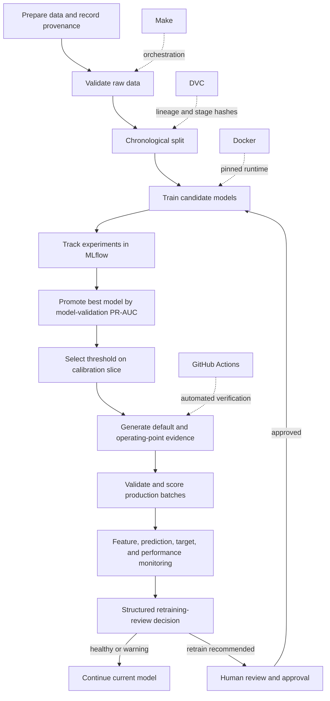

# 95+ Rubric Upgrade Design

- **Date:** 29 July 2026
- **Status:** Approved for implementation planning
- **Target:** 97/100 internal target, providing a two-mark buffer above 95
- **Scope:** Complete group submission: repository, technical report, evidence,
  presentation/demo, and four individual reflections

## 1. Context

The current submission is a strong technical baseline with an evidence-backed
provisional mark of 77.5/100. Its technical subtotal is 75.5/90 (83.9%).
The main losses come from incomplete presentation/reflection deliverables,
partially integrated DVC, a false-positive monitoring alert, skipped dashboard
tests in a clean checkout, non-operating-threshold evaluation artefacts, and
several documentation contradictions.

The goal is not to add the largest possible tool stack. The goal is to make
every rubric claim true, directly verifiable, internally consistent, and
professionally presented.

## 2. Design principles

1. **Rubric evidence over feature count.** Every change must improve a named
   rubric criterion or remove a known deduction.
2. **Honest operational claims.** The system implements a retraining review
   decision, not uncontrolled automatic retraining or promotion.
3. **Machine-readable evidence first.** Report, dashboard, and slides consume
   the same generated metrics rather than maintaining separate numbers.
4. **One reproducible path per purpose.** Make handles the real-data submission
   run; DVC and CI demonstrate deterministic synthetic reproduction.
5. **Fail visibly.** Required validation, registry, and evidence steps fail the
   pipeline when broken. Optional presentation layers record warnings without
   hiding errors.
6. **Minimal additions.** Reuse the existing modules and tools. Do not introduce
   Kubernetes, a feature store, Airflow, a hosted API, or microservices.

## 3. Internal score target

| Rubric criterion | Internal target |
|---|---:|
| Workflow reorganisation and MLOps architecture | 19.5/20 |
| Appropriate use of MLOps tools | 19.5/20 |
| Systematic testing, monitoring, and retraining | 19.5/20 |
| Technical implementation quality | 14.5/15 |
| Reproducibility and documentation | 14.5/15 |
| Presentation/demo and individual reflection | 9.5/10 |
| **Total** | **97/100** |

The target is an internal quality bar, not a guaranteed academic mark. The
final mark remains the assessor's decision.

## 4. Definition of success

The upgrade is complete only when all of the following are true:

- A fresh clone runs the documented verification command successfully.
- The full test suite passes with zero skips.
- Make, DVC, Docker, and GitHub Actions reproduction paths are evidenced.
- Healthy monitoring input produces no retraining alert.
- Degraded monitoring input produces a structured retraining decision.
- The primary evaluation report and confusion matrix use the selected operating
  threshold; threshold 0.5 is retained only as a named comparison.
- Every report and slide metric traces to a committed machine-readable artefact.
- The final report contains 4,000–5,000 rendered words and no unresolved
  instructions or unsupported claims.
- A professional 8–10-minute presentation is rehearsed and backed up.
- Four authentic 500–800-word reflections are complete.

## 5. Target architecture



The loop is deliberately approval-gated. Monitoring may recommend retraining,
but it does not silently replace the serving model.

## 6. Data segmentation and contracts

### 6.1 Chronological segmentation

The dataset remains ordered by `Time`. It is divided as follows:

| Slice | Fraction | Purpose |
|---|---:|---|
| Training | 50% | Fit scaler and candidate models |
| Model validation | 10% | Compare candidates and choose the promoted model |
| Threshold calibration | 10% | Select the cost-based operating threshold and freeze baseline metrics |
| Production batch 1 | 10% | Unseen monitoring batch |
| Production batch 2 | 10% | Unseen monitoring batch |
| Production batch 3 | 10% | Unseen monitoring batch with clearly labelled injected drift |

This separates model selection from threshold tuning while preserving 30% of
the chronology for production-like monitoring. Production batches remain
unseen during training, model selection, and threshold calibration.

### 6.2 Stage contracts

| Stage | Required inputs | Primary outputs |
|---|---|---|
| Data preparation | Source selection, simulation parameters | Raw CSV, provenance JSON |
| Validation | Raw CSV | Validation report JSON |
| Ingestion | Validated raw CSV, validation report | Six chronological CSV slices |
| Training | Training and model-validation slices | Candidate runs, promoted model, scaler, promotion record |
| Calibration | Promoted model, calibration slice | Threshold JSON, trade-off figure |
| Evaluation | Model, scaler, threshold, calibration slice | Default and operating metric JSONs and figures |
| Inference | Model bundle, production batch | Probability and decision output; labels included only when available |
| Monitoring | Reference data, predictions, optional labels | Per-batch drift JSON/HTML, summary JSON |
| Decision | Monitoring summary, baseline metrics | Trigger decisions JSON and human-readable log |
| Dashboard | Generated evidence | Static site |

Training cannot begin without successful validation evidence. Monitoring and
the dashboard consume generated contracts rather than reimplementing metric or
decision logic.

## 7. Technical component design

### 7.1 Validation

Validation is split into two explicit contracts:

- **Labeled training contract:** `Time`, `V1`–`V28`, `Amount`, and `Class` are
  required. Numeric values must be finite, `Time` and `Amount` must be
  non-negative, `Class` must be binary, and the dataset must contain both
  classes. The labeled training, model-validation, and calibration slices must
  each have a fraud rate greater than 0 and no more than 5%. This catches empty
  targets and grossly incorrect class distributions while allowing the genuine
  ULB rate of approximately 0.172%.
- **Inference contract:** requires the complete feature schema but permits
  `Class` to be absent. When `Class` is present it is validated with the labeled
  contract.

`reports/validation_report.json` records row count, column set, data types,
null counts, relevant ranges, fraud count/rate when labels exist, each check,
and the overall result. Invalid required data exits non-zero before ingestion,
training, or scoring.

### 7.2 Training and MLflow

The existing Logistic Regression and XGBoost experiments remain. Each run logs:

- complete estimator hyperparameters;
- class-imbalance configuration;
- source provenance and dataset fingerprint;
- parameter-file fingerprint;
- model-validation metrics;
- model artefact and scaler information.

Promotion remains based on model-validation PR-AUC. The promotion record stores
the winning model, MLflow run ID, registered-model version, model-validation
metrics, data fingerprint, and reason for selection.

The default SQLite backend is required to support the Model Registry. Registry
failure is a required-stage failure rather than a broadly swallowed exception.
The local model bundle remains the batch runtime contract; MLflow remains the
tracking and governance record. This separation is documented explicitly.

`reports/experiment_comparison.json` provides a stable, marker-friendly summary
of every candidate and the promoted run.
`reports/promotion_record.json` exposes the complete promotion record without
requiring access to the ignored local MLflow database.

### 7.3 Threshold calibration and evaluation

Threshold calibration uses only the calibration slice. It sweeps the existing
threshold grid and minimises the stated false-negative/false-positive cost.

Evaluation emits two clearly named views:

- `reports/metrics_default.json` and
  `reports/figures/confusion_matrix_default.png` for threshold 0.5;
- `reports/metrics_operating.json` and
  `reports/figures/confusion_matrix_operating.png` for the selected threshold.

Both include PR-AUC, ROC-AUC, precision, recall, F1, FPR, FNR, TP, FP, FN, TN,
threshold, and estimated business cost. The operating view is primary in the
README, dashboard, report, and slides. The default view exists only to explain
why threshold selection matters.

`reports/operating_point.json` records the selected threshold, cost assumptions,
calibration metrics, promoted-model identifier, and calibration-data
fingerprint. The old ambiguous `reports/metrics_valid.json` artefact is retired
so it cannot be mistaken for operating evidence.

### 7.4 Batch inference

Batch inference validates features before scoring. It supports:

- labeled course-simulation batches, which retain `Class` for delayed
  performance evaluation; and
- genuinely unlabeled batches, which produce probabilities and decisions
  without a target column.

The output records the operating threshold and promoted-model identifier so a
prediction batch remains auditable.

### 7.5 Monitoring

Monitoring retains native PSI and KS reporting plus optional Evidently HTML.
It records:

- feature and `Amount` drift;
- prediction-probability drift;
- target-rate drift when labels exist;
- PR-AUC, precision, recall, and cost when labels exist;
- label status (`available` or `pending`).

If labels are pending, performance fields are explicitly unavailable and the
decision uses only label-independent signals. Evidently failure does not stop
native monitoring, but the error type and message are recorded instead of
silently disappearing.

### 7.6 Retraining review decision

The existing threshold logic remains configurable and calibrated:

- PR-AUC drop greater than 10%;
- recall below 0.75 at the operating threshold;
- more than 50% of monitored features drifted;
- 25–50% feature drift produces a warning.

`reports/trigger_decisions.json` contains:

- baseline values and thresholds;
- one decision per batch;
- machine-readable reason codes and human-readable reasons;
- overall status (`ok`, `warning`, or `retrain`);
- label availability.

The Markdown trigger log is generated from this JSON contract. GitHub Actions
parses `overall_status` rather than searching prose for the word `retrain`.
An `ok` run emits no false warning; a `retrain` run emits a visible annotation
and requires human approval before any training workflow is started.

### 7.7 Dashboard

The dashboard uses operating-threshold metrics as its primary view and provides
the threshold-0.5 figures only as a comparison. It displays:

- provenance and data fingerprint;
- promoted model and MLflow run/version;
- operating threshold and business-cost rationale;
- per-batch monitoring status and reason codes;
- label status;
- links to complete drift evidence.

The dashboard remains static, self-contained, and deployable to GitHub Pages.

## 8. Orchestration and reproducibility

### 8.1 Make

Make dependencies express the real gate order:

`data → validate → ingest → train → threshold → evaluate → inference → drift → trigger`

The dashboard depends on generated evidence. A single verification target runs
the pipeline, dashboard, and full test suite.

The real-data path remains:

```text
make fetch-data
make verify
```

The offline path remains synthetic and deterministic.

### 8.2 DVC

DVC is initialized and the repository commits its metadata and `dvc.lock`.
Its default clean-clone path uses deterministic synthetic data so CI does not
depend on Kaggle or OpenML availability. DVC tracks the stage graph, inputs,
parameters, output hashes, metrics, and plots.

DVC synthetic reproduction runs in a clean temporary checkout in CI and through
the documented DVC verification command. It never overwrites the real dataset
in a working tree used for the authoritative submission run.

The documentation does not claim that the 144 MB real CSV is stored in a DVC
remote. Real data is reproduced from its public source with a recorded checksum
and provenance. DVC's role is pipeline lineage, parameter sensitivity, metrics,
and artefact hashes.

CI installs the pinned DVC version and executes `dvc repro`. A DVC failure fails
CI.

### 8.3 Docker and dependencies

The README states Python 3.13 prominently. Top-level dependencies, including
DVC, are exact pins. The Docker base image is pinned by immutable digest and its
runtime must report Python 3.13.9, matching the verified development runtime.

The Docker verification path runs the same repository verification target,
not a second implementation.

### 8.4 GitHub Actions

CI performs:

1. dependency installation;
2. fast unit tests;
3. DVC synthetic reproduction;
4. complete verification, including dashboard checks;
5. evidence-consistency tests;
6. artefact upload.

Scheduled monitoring fetches real data when available, runs the verified
pipeline, builds the dashboard, parses the structured decision, publishes the
summary, uploads evidence, and deploys Pages.

## 9. Test strategy

The suite is divided by purpose, not by an arbitrary target count.

### 9.1 Unit coverage

- chronological six-way segmentation and disjointness;
- labeled and unlabeled validation;
- target-distribution validation;
- metric and cost calculations;
- operating-threshold selection;
- PSI and feature-drift behavior;
- trigger reason codes and all three statuses;
- labeled and unlabeled inference;
- healthy alert parsing versus retraining alert parsing.

### 9.2 Integration coverage

- MLflow candidate tracking, promotion record, and registry version;
- complete synthetic pipeline;
- generated default and operating evidence;
- dashboard generation from self-contained temporary evidence;
- report/dashboard metric consistency;
- DVC reproduction;
- clean-clone verification.

Dashboard tests create minimal temporary artefacts and never skip because
workspace-generated models are absent. Any intentionally environment-specific
test is explicitly selected by a test marker rather than silently skipped.

## 10. Evidence package

The repository adds or finalises:

- `docs/RUBRIC_EVIDENCE.md`;
- `docs/MODEL_CARD.md`;
- `reports/validation_report.json`;
- `reports/experiment_comparison.json`;
- `reports/promotion_record.json`;
- `reports/operating_point.json`;
- `reports/metrics_default.json`;
- `reports/metrics_operating.json`;
- default and operating confusion matrices;
- `reports/drift_summary.json`;
- `reports/trigger_decisions.json`;
- `reports/trigger_log.md`;
- `reports/run_manifest.json`.

`docs/RUBRIC_EVIDENCE.md` maps each criterion to:

1. the claim;
2. the implementation location;
3. generated evidence;
4. the verification command or public CI run;
5. limitations.

`reports/run_manifest.json` records source provenance, data fingerprint,
parameter fingerprint, dependency versions, and source commit used for the run.

An evidence-consistency test verifies that promoted model, threshold, primary
metrics, and trigger decisions agree across the machine-readable artefacts used
by the dashboard and report.

## 11. Documentation design

### 11.1 README

The README provides three explicit paths:

- quick deterministic synthetic run;
- real-data submission run;
- complete verification.

It names Python 3.13, explains Make/DVC/Docker roles accurately, links the
evidence matrix, and distinguishes committed evidence from regenerated MLflow
and Evidently artefacts.

### 11.2 Workflow diagrams

The diagrams show:

- validation as a gate;
- separate model-validation and calibration slices;
- structured monitoring decisions;
- human approval before retraining;
- the actual roles of Make, DVC, Docker, MLflow, and CI.

### 11.3 Technical report

The report remains within 4,000–5,000 rendered words. Existing prose is replaced
where necessary rather than enlarged indiscriminately. It:

- removes approval instructions and authoring notices;
- reconciles all trigger thresholds;
- corrects the synthetic-threshold statement;
- explains DVC without claiming a nonexistent remote;
- reports the final test result accurately;
- compares default and operating thresholds;
- uses the final real-data evidence;
- acknowledges limitations and responsible AI use honestly.

The final report is exported to a visually verified PDF or DOCX. All tables,
figures, page breaks, links, and captions are inspected before submission.

### 11.4 Model card

The model card states intended use, excluded uses, data limitations, model and
threshold selection, operating metrics, monitoring signals, label-delay
behavior, retraining-review policy, ethical risks, and upgrade path.

## 12. Presentation design

The target duration is 9:15–9:40. Ten slides tell one evidence-led story:

| Time | Slide | Purpose |
|---|---|---|
| 0:00–0:40 | Problem and objective | Frame operational fraud detection and the learning objective |
| 0:40–1:20 | Original workflow | Show why the notebook is insufficient |
| 1:20–2:10 | Requirements and architecture | Map all eight requirements to stages |
| 2:10–3:00 | Reproducible pipeline | Show validation and orchestration |
| 3:00–4:00 | Experiments and promotion | Compare MLflow runs |
| 4:00–5:10 | Threshold decision | Contrast default and operating results |
| 5:10–6:30 | Monitoring | Compare healthy and degraded batches |
| 6:30–7:40 | Retraining review | Explain structured decision and approval gate |
| 7:40–8:40 | Reproducibility evidence | Show DVC, Docker, tests, CI, and dashboard |
| 8:40–9:30 | Limitations and conclusion | Demonstrate judgment and close the reorganisation story |

Each workstream owner speaks to their genuine contribution. Slides use one
message each, readable charts, minimal code, and metrics drawn from the evidence
package.

The pipeline is pre-run. The live demo shows the command and resulting evidence
without waiting for model training. Offline screenshots and a short recording
of MLflow and the dashboard provide a fallback.

The team completes three rehearsals:

1. content and factual accuracy;
2. timing and transitions;
3. recorded dress rehearsal with question practice.

Prepared questions cover class imbalance, leakage, cost assumptions, DVC's
scope, label delay, drift calibration, synthetic injection, and the human
approval gate.

## 13. Individual reflections

Each of the four members writes an authentic 550–700-word reflection in their
own voice. Each covers:

- specific files, decisions, reviews, or pairing work they contributed;
- one MLOps concept they can now explain;
- one genuine challenge and their response;
- collaboration and feedback;
- one limitation and future improvement;
- responsible-AI use and personal verification.

The four reflections must not reuse the same experience or phrasing. Assistance
may check structure, clarity, word count, and rubric coverage, but must not
invent work or personal learning.

The public repository does not need to expose private reflection documents.
The final submission bundle includes them through the university submission
channel.

## 14. Three-week delivery schedule

### Week 1 — Technical correctness

| Days | Outcome |
|---|---|
| 1–2 | Validation contracts/report, six-way split, stage gates |
| 3–4 | MLflow traceability, calibration split, operating metrics |
| 5 | Labeled/unlabeled inference and monitoring decisions |
| 6 | DVC initialization, lockfile, CI reproduction |
| 7 | Full synthetic verification and defect review |

### Week 2 — Evidence and documentation

| Days | Outcome |
|---|---|
| 8–9 | Evidence artefacts, consistency tests, dashboard updates |
| 10 | Real-data run and frozen quantitative evidence |
| 11–12 | README, diagrams, model card, report revision |
| 13 | Visually verified final report and first slide deck |
| 14 | Evidence audit and four reflection drafts |

### Week 3 — Delivery and assurance

| Days | Outcome |
|---|---|
| 15–16 | Reflection review, presentation content rehearsal |
| 17 | Timed rehearsal and slide refinement |
| 18 | Clean-clone, DVC, Docker, and CI verification |
| 19 | Recorded dress rehearsal, backup media, Q&A |
| 20 | Code and evidence freeze; final bundle inspection |
| 21 | Submission buffer |

No new feature work begins after Day 18 unless it corrects a submission-blocking
defect.

## 15. Ownership

The existing four workstreams remain:

- **Data engineering:** validation, segmentation, provenance, DVC.
- **Modelling:** MLflow, promotion, calibration, evaluation.
- **Monitoring:** inference, drift, structured decision, dashboard.
- **Platform and documentation:** CI, Docker, evidence matrix, report and deck
  integration.

Every member reviews cross-workstream claims and owns their individual
reflection. Contribution evidence must reflect actual work rather than planned
ownership.

## 16. Final verification gates

### Technical gate

- Fast unit suite passes.
- Full verification target passes.
- `dvc repro` passes in a fresh clone.
- Docker image builds and executes verification.
- CI and scheduled monitoring are green.
- Healthy and degraded alert scenarios behave correctly.

### Evidence gate

- Every required artefact exists.
- Evidence-consistency tests pass.
- Report, dashboard, README, and slides agree on model, threshold, and metrics.
- Every external source and baseline notebook is acknowledged.

### Content gate

- Report rendered word count is 4,000–5,000.
- Four reflections are 500–800 words each.
- Presentation is 8–10 minutes.
- No unresolved instructions, contradictory thresholds, stale counts, or
  unsupported claims remain.
- All links, figures, tables, captions, and final exported files are visually
  inspected.

## 17. Risks and mitigations

| Risk | Mitigation |
|---|---|
| New segmentation changes all reported numbers | Freeze code first, then perform one authoritative real-data evidence run |
| DVC adds complexity without value | Restrict it to lineage, hashes, metrics, and deterministic synthetic CI |
| Live demo failure | Pre-run outputs, offline screenshots, and a short backup recording |
| Report exceeds word limit | Replace stale prose instead of appending sections |
| Reflections sound duplicated or artificial | Each member writes from distinct real work and receives only rubric/clarity review |
| Late feature work destabilises evidence | Stop feature work after Day 18 and retain a submission buffer |
| A metric drifts between outputs | Generate consumers from shared JSON and enforce consistency tests |

## 18. Explicit non-goals

- No real-time serving API.
- No automatic production model replacement.
- No Kubernetes or workflow platform migration.
- No feature store.
- No new modelling family unless an existing candidate becomes non-functional.
- No explainability package until every rubric-critical gate is complete.

These can be discussed as future work. They are not needed to demonstrate the
required MLOps reorganisation.
