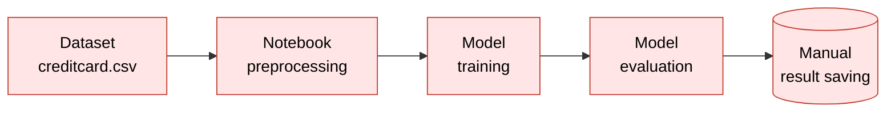
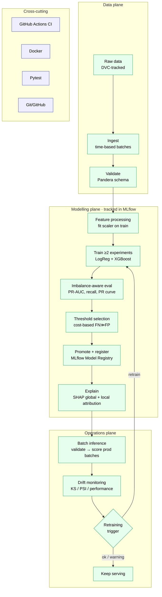

# Before / after workflow diagrams

Required deliverable (briefing §7, §14). These render on GitHub and are reused
in the technical report and the slides.

## Before — original notebook workflow

A single linear notebook, run top-to-bottom, with manual result saving and no
operational safeguards.

**Weaknesses (MLOps view):** no data validation, no experiment tracking, a
random-only split (leakage risk), a fixed 0.5 threshold ignoring asymmetric
costs, no monitoring or drift analysis, no retraining logic, and no
reproducibility (unpinned env, manual steps, nothing under CI).

## After — reorganised MLOps workflow

Each notebook concern becomes an explicit, tested, tracked stage. Arrows are the
artefact dependencies enforced by the `Makefile` / `dvc.yaml`.

The **retrain** edge from the trigger back to training closes the loop: when a
production batch breaches the trigger rule, the workflow re-enters at the
training stage to produce an updated model version.

`explain` sits after registration because it attributes the *promoted* model's
scores, not a candidate's. In the `Makefile` it runs between `evaluate` and
`inference`; in `dvc.yaml` it is a leaf stage, since its evidence
(`reports/explainability.json` and the two SHAP figures) is consumed by
[`docs/MODEL_CARD.md`](MODEL_CARD.md) and by analysts rather than by a
downstream stage.

## Requirement → stage mapping

| # | New requirement (briefing §4)        | Stage(s) that address it            |
|---|--------------------------------------|-------------------------------------|
| 1 | Regular new transaction batches      | `ingest`, `batch_inference`         |
| 2 | Fraud patterns change over time      | `drift`, `retrain_trigger`          |
| 3 | Fraud is rare (~0.172%)              | `evaluate` (PR-AUC/recall), class weights / `scale_pos_weight` in `train` |
| 4 | Asymmetric FN/FP cost                | `threshold`, `explain` (why a case was flagged) |
| 5 | Reproducibility                      | Docker, DVC, pinned deps, seeds, CI |
| 6 | Data-quality checks                  | `validate` (Pandera)                |
| 7 | Experiment tracking                  | `train` (MLflow + registry)         |
| 8 | Justified retraining decisions       | `retrain_trigger`                   |
